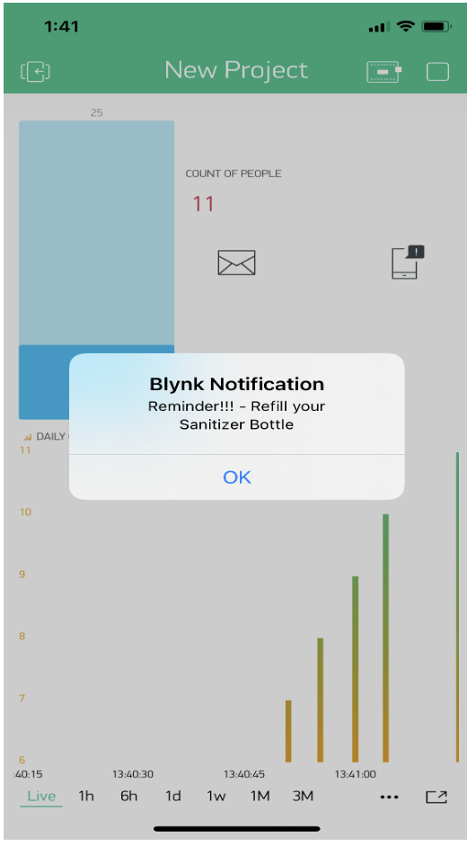

# Contactless-hand-Sanitizer-dispenser-using-IoT

## Table of Content

 1. Overview
 2. Problem Statement
 3. Motivation
 4. Proposed Soultion
 5. Features
 6. Hardware used
 7. Technologies-used
 8. Block Diagram
 9. Circuit Diagram
10. Workflow
11. Result and Discussion 
12. Scope

### Overview
Corona Virus disease has spread to more than 213 countries infecting more 7 million people and killing over 403,202 globally, according to data compiled by worldometer (as on June 5, 2020)As the pandemic slowly settles and such sectors become eager to resume in-person work, individuals are still skeptical of getting back to the office. 65 percent of employees are now anxious about returning to the office (Woods,2020). Multiple studies have shown that the use of Sanitizers reduces the risk of viral transmission as well as provides a sense of protection. However, it is infeasible to manually enforce such a policy on large premises and track any violations. Contact-less Hand-Sanitizer Dispenser proviedes a better alternative. Using a combination of micro-controller, motor and sensor we developed a robust system that can dispense sanitizer hundred percent contact free.

### Problem Statement 
Corona Virus disease has been spreading to more than 96.2M million people and killing over 2.06M till now. Despite the vaccine, the second wave of the virus has came and affect almost all countries imposed lockdown. So in such circumstances, social distancing and use of contact less hand sanitizers is an effective way to tackle the deadly corona virus.

### Motivation
To limit Corona Virus spread, social distancing and observing hygiene standards like compulsory wearing of mask, use of hand gloves, face shield, and use of sanitizer is very important. So we are planing to develop a completely contact less hand-sanitizer dispenser.

### Proposed Solution
Many Organizations are making it compulsory to follow social distancing and use hand-sanitizers. Our Objectives are as follows:
To develop a completely contact free hand sanitizer dispenser.

### Features
- Automatic Hand triggered dispenser
- Reminder for sanitizing Hands
- Fluid Level Detection
- Mobile and Email reminder for Bottle refilling.
- Log Record of People using Dispenser (Count people)

### Hardware Used
- Arduino Uno  
- Node MCU
- Water Pump
- Ultrasonic sensor
- IR Sensor
- Speakers 
- 12V Adapter

### Technologies Used  
- Arduino IDE 
- Audacity 
- VS Code
- Blynk Libraries and Server
- Blynk Aoplication

### Block Diagram

### Circuit Diagram 

### Workflow 

- #### Technique to automate hand sanitizer dispenser.
When we place our hand in front of ultrasonic sensor, Arduino will read the signals from these sensors and if hands are in a desired range it will trigger and then the and will turn on the DC motor after receiving signal from Arduino and people will be able to santize thier hands.

- #### Technique to get Reminder from Speakers to sanitize hands.
So Speaker are connected to the ardiuno at pin no 4. the mp3 recorded voice is been formatted to 16bit pcm frequency rate to 8000Hz using audacity. so if the object is not in the desired range the speakers will say Sanitize your hands before entering the premises. if the object is in the desired range as the arduino triggers the dc motor the speakers will say Thankyou for sanitizing your hands and have a nice day!

- #### Technique to get Email & mobile notification reminder for refilling sanitizer bottle.
So ardiuno is interface with Node MCU wifi Module.using blynk app we can set an alert.so for counting no of people santizing thier hands we are using IR sensor.so now if the no of people exceeds the value of alert, then with the help of blynk server and mobile app an Email notification will be send as areminder to refill the hand sanitizer bottle.

- #### Technique for Fluid Level Detection and Log record of people using Dispenser.
So ardiuno is interface with Node MCU wifi Module. using blynk app we can set an value i.e suppose at this count the santizier fluid will be at the empty point and need to refill it. so for counting no of people santizing thier hands we are using IR sensor.so as people starts sanitizng thier hands and as the count of no of people sanitizing thier hands increases, fluid level indicator starts decreasing.also People can live monitor the amount of fluid present in the sanitizer bottle with the help of blynk server on mobile app.we can also see the log record of people sanitizing thier hands daily while setting a virtual pin V1 in code & analyze the records on superchart on mobile application using blynk app.

### Result and discussion

##### when the first person starts sanitizing his hands the fluid level detector in interface with blynk app shows 100 % filled and the counter shows 1 which       indicates one person has sanitize his hands and superchart is shown to indicate log records of people sanitizing thier hands daily. after sanitizng the speakers also says thank you for sanitizing your hands and have a nice day!

##### As the third person finishes and 4th person start sanitizing his hands the fluid level detector interface with blynk app shows 75 % filled and the counter shows 4 which indicates 4 person has sanitize thier hands and superchart is shown to indicate log records of people sanitizing thier hands daily.after sanitizng the speakers also says thank you for sanitizing your hands and have a nice day!

##### As the 5th person finishes and 6th person starts sanitizing his hands the fluid level detector interface with blynk app shows 50 % filled and the counter shows 5 which indicates five person has sanitize thier hands and superchart is shown to indicate log records of people sanitizing thier hands daily.after sanitizng the speakers also says thank you for sanitizing your hands and have a nice day!

##### As the 7th person finishes and 8th person start sanitizing his hands the fluid level detector interface with blynk app shows 25 % filled and the counter shows 7 which indicates seven person has sanitize his hands and superchart is shown to indicate log records of people sanitizing thier hands daily.after sanitizng the speakers also says thank you for sanitizing your hands and have a nice day!

##### As the 10th person finishes and 11th person start sanitizing his hands the fluid level detector interface with blynk app shows 25 % filled and the counter shows 11 which indicates eleven person has sanitize thier hands and superchart is shown to indicate log records of people sanitizing thier hands daily.after sanitizng the speakers also says thank you for sanitizing your hands and have a nice day!.as soon as the voice stops we get an email and mobile notification for refilling sanitizer bottle.

##### As soon as the 10th person finishes sanitizing his hands which means sanitizer bottle is left with very less amount of sanitizer in it so an mobile notification is send in blynk app to remind the person to refill the sanitizer bottle.

##### As soon as the 10th person finishes sanitizing his hands which means sanitizer bottle is left with very less amount of sanitizer in it so an email notification is send in blynk app to remind the person to refill the sanitizer bottle.

### Features Accuracy
The hardware design of automatic hand sanitizer dispenser shown in the figure 1 represents, the way ultrasonic and IR sensor are been mount in the box to gives very well accuracy to whole system. the product gives 96-98 % of accuracy for automatic hand sanitizer dispenser. For reminding people for sanitizing thier hands and giving thankyou note after sanitizing hands the product can give accuracy upto 45 %. for email and mobile notification reminders for refilling sanitizer bottle and monitoring live fluid level detection indicator the product can give accuracy upto 91-93 %.and also for log record of people sanitizing thier hands daily to track covid appropriate behaviour amongs the people it can give accuracy upto 81-85%. So the overall accuracy of the system with all the features included in the product can give the accuracy upto 83-85 %.each featuresś accuracy is Shown below in the table as well.

### Scope 

- This product can be used in hospital, public location, school, colleges, Airports, hotels restaurants, shopping malls, banks etc for sanitizing hands.
- It reminds people using speakers so people entering the premises can sanitize thier hands and it also gives thank-you for sanitizing your hands feedback once     person finished sanitizing hands.
- It gives email and mobile notification reminder for refilling the sanitizer bottle and also we can monitor live fluid level detection indicator( i.e the amount   of sanitizer fluid present in the bottle) on mobile app.
- Also we can have a log record of people sanitizing thier hands daily to track how many people sanitize thier hands and it can be used to take surveys about how   much people are aware and taking precautions about covid appropriate behaviour.

### Video Presentation 

###  Made with &nbsp;❤️ by  [Karan Shah](https://github.com/karan19100) , [Kavish Shah](https://www.linkedin.com/in/kavish-shah-4243781b1/) 

